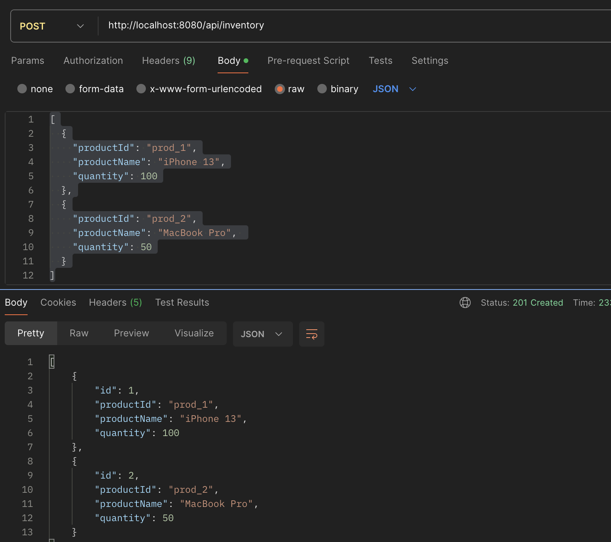

# E-Commerce Order API
A Spring Boot application for managing orders with order items in a 1:M relationship.

## Features
- Create orders with multiple items
- H2 database for development
- RESTful API endpoints


# create  a sample order
```
curl -X POST http://localhost:8080/api/orders \
  -H "Content-Type: application/json" \
  -d '{
    "customerId": 123,
    "items": [
      {
        "productId": "prod-1002",
        "quantity": 3,
        "unitPrice": 21
      }
    ]
  }'
```

# check all exposed endpoints
```
 @Override
    public void run(ApplicationArguments args) throws Exception {
        System.out.println("\n===== REGISTERED ENDPOINTS =====");
        requestMappingHandlerMapping.getHandlerMethods().forEach((key, value) -> {
            System.out.println(key + " -> " + value);
        });
        System.out.println("==============================\n");
    }
```
# bean not found error
```
@SpringBootApplication(scanBasePackages = {"com.example.ecommerce.demo.controller","service","model", "repository","model","dto"})

```


# login to h2 
- url -> jdbc:h2:~/testdb
- username -> sa
- password -> leave blank
