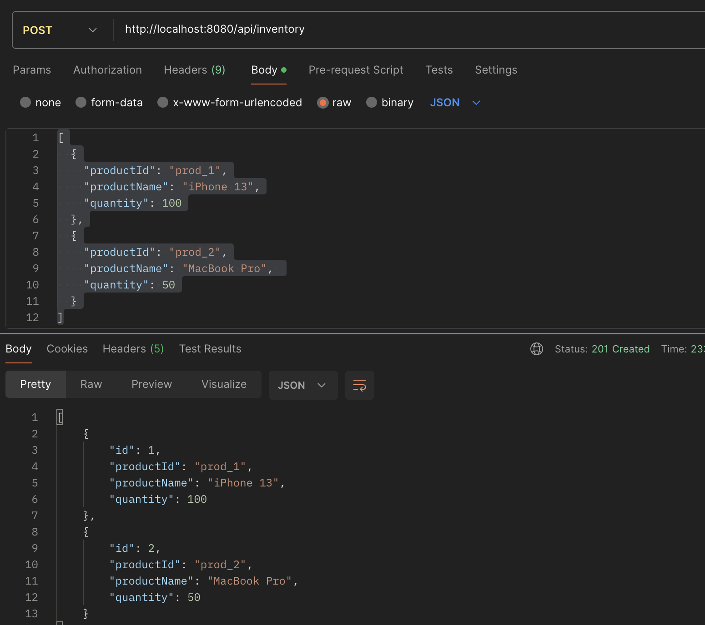
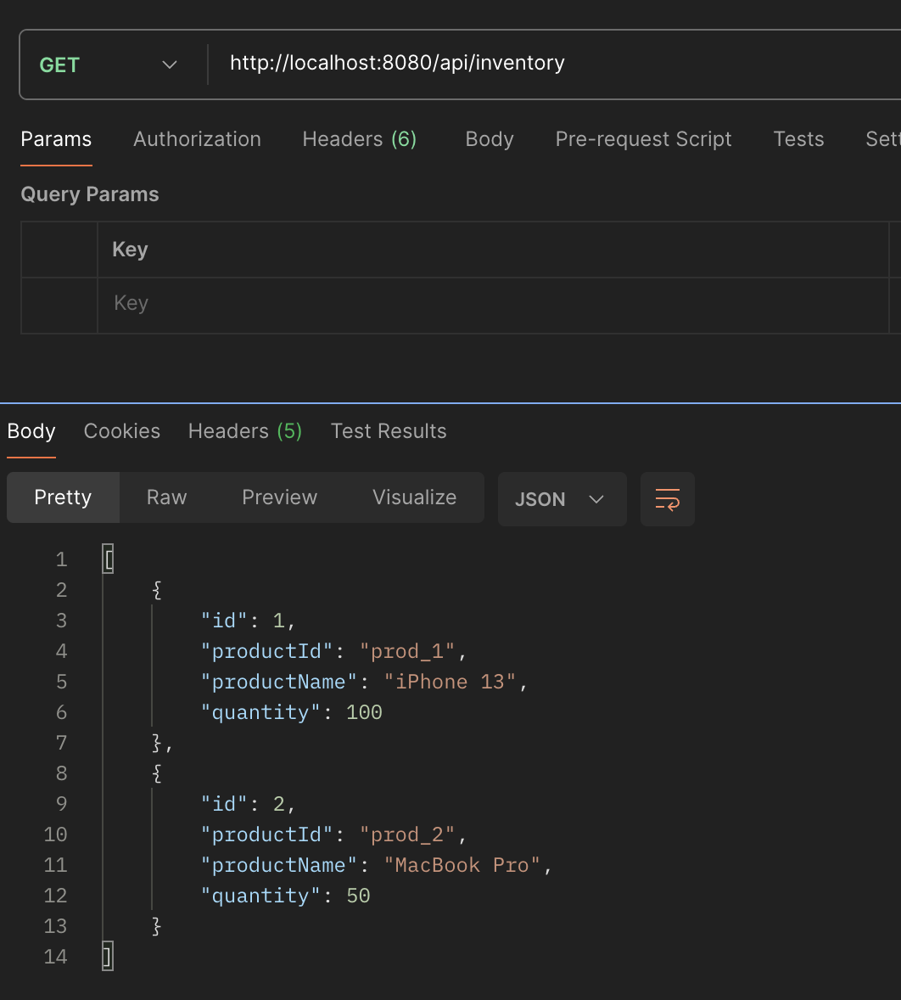
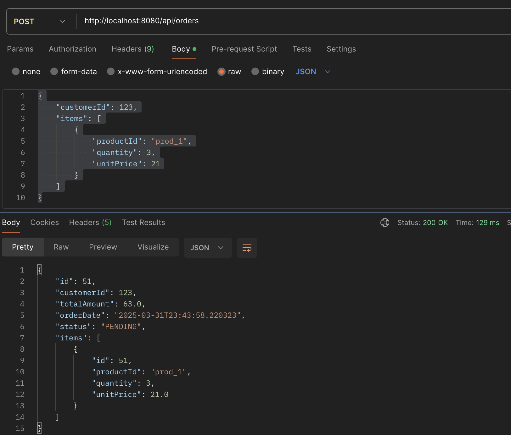
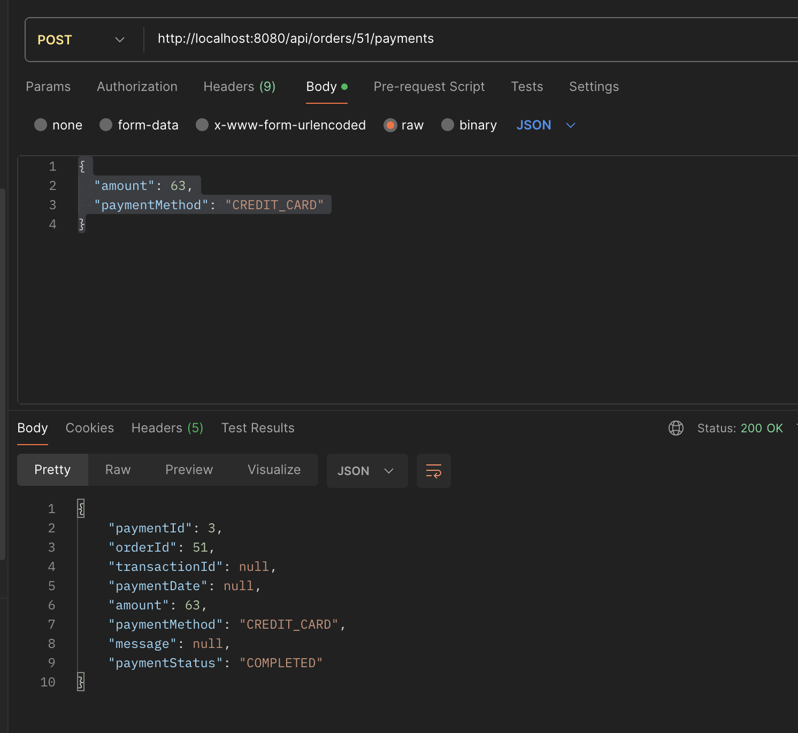
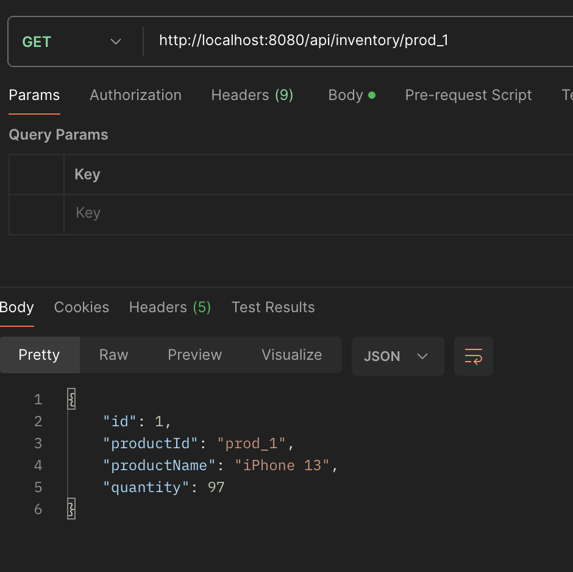

# E-Commerce Order API
A Spring Boot application for managing orders with order items in a 1:M relationship.

## Features
- Create orders with multiple items, do payment and check for inventory


# load inventory
```
curl -X POST http://localhost:8080/api/inventory \
  -H "Content-Type: application/json" \
  -d '[
  {
    "productId": "prod_1",
    "productName": "iPhone 13",
    "quantity": 100
  },
  {
    "productId": "prod_2",
    "productName": "MacBook Pro", 
    "quantity": 50
  }
]'
```



# get inventories
```
http://localhost:8080/api/inventory
```



# create order

```
curl -X POST http://localhost:8080/api/orders \ 
 -H "Content-Type: application/json" \
{
    "customerId": 123,
    "items": [
        {
            "productId": "prod_1",
            "quantity": 3,
            "unitPrice": 21
        }
    ]
}

```



# process payment

POST http://localhost:8080/api/orders/51/payments
```
{
  "amount": 63,
  "paymentMethod": "CREDIT_CARD"
}
```




# validate inventory for deduced item

GET
```
http://localhost:8080/api/inventory/prod_1
```


